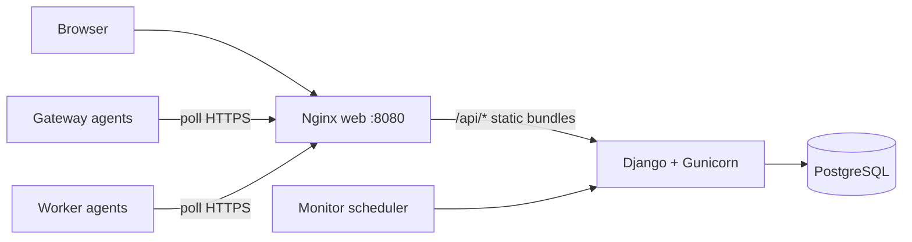

# Headscale Management

Control plane for operating many **Headscale + Headplane** tenants, VPS workers, and gateway agents from a single web UI and API.

## Architecture



| Component | Role |
|-----------|------|
| **web** | Serves the React UI and reverse-proxies API/agent script routes to the backend |
| **backend** | Django REST API, session auth, RBAC, gateway/worker/tenant lifecycle |
| **postgres** | Persistent registry (users, gateways, monitoring, commands) |
| **scheduler** | Enqueues due gateway network monitor scans every 60s |
| **Gateway/worker agents** | Run **outside** Docker on edge hosts; poll the control plane URL |

## Quick start (Docker Compose)

### Prerequisites

- Docker Engine 24+ and Docker Compose v2
- Free host port for the UI (default **8080**; change `WEB_PORT` if busy)

### 1. Configure environment

```bash
cp .env.example .env
# Edit at minimum:
#   POSTGRES_PASSWORD
#   DJANGO_SECRET_KEY   (openssl rand -hex 32)
#   ADMIN_PASSWORD
```

### 2. Build and run

```bash
docker compose up -d --build
```

### 3. Open the app

- UI: http://localhost:8080 (or your `WEB_PORT`)
- Login: `ADMIN_USERNAME` / `ADMIN_PASSWORD` from `.env` (defaults `admin` / `admin`)

### 4. Verify

```bash
docker compose ps
docker compose logs -f backend
cd backend && uv run python ../scripts/docker-smoke-test.py
# Override if not using 8080:
SMOKE_BASE_URL=http://127.0.0.1:8081 uv run python ../scripts/docker-smoke-test.py
```

## Docker services

| Service | Image | Description |
|---------|-------|-------------|
| `postgres` | `postgres:16-alpine` | Database (volume `postgres_data`) |
| `backend` | Built from `backend/Dockerfile` | Runs migrations, `collectstatic`, optional `seed_admin`, then Gunicorn |
| `web` | Built from `frontend/Dockerfile` | Nginx: SPA + proxy to backend |
| `scheduler` | Same as backend | `run_gateway_monitor_scheduler` loop |

### Useful commands

```bash
# Logs
docker compose logs -f web backend scheduler

# Restart after .env changes
docker compose up -d --force-recreate backend web scheduler

# Django shell
docker compose exec backend uv run python manage.py shell

# Create/update admin manually
docker compose exec backend uv run python manage.py seed_admin --force

# Run migrations manually
docker compose exec backend uv run python manage.py migrate

# Stop and remove containers (keeps DB volume)
docker compose down

# Stop and wipe database
docker compose down -v
```

## Environment variables

See [`.env.example`](.env.example) for the full list. Key variables:

| Variable | Purpose |
|----------|---------|
| `WEB_PORT` | Host port mapped to the web UI (nginx) |
| `VITE_API_URL` | Leave **empty** for same-origin API via nginx (recommended in Compose) |
| `DJANGO_SECRET_KEY` | Required in production |
| `DJANGO_DEBUG` | `true` for local Compose; **`false` in production** |
| `DJANGO_ALLOWED_HOSTS` | Comma-separated hostnames |
| `CORS_ALLOWED_ORIGINS` | Must include the public UI URL (e.g. `http://localhost:8080`) |
| `SESSION_COOKIE_SECURE` / `CSRF_COOKIE_SECURE` | Set `false` for plain HTTP locally; **`true` behind HTTPS** |
| `POSTGRES_*` | Database connection (Compose sets `POSTGRES_HOST=postgres` internally) |
| `ADMIN_USERNAME` / `ADMIN_PASSWORD` | Initial admin created on first backend start |

## Production deployment

1. **Secrets** — Generate strong `DJANGO_SECRET_KEY` and `POSTGRES_PASSWORD`; never commit `.env`.
2. **HTTPS** — Terminate TLS at nginx/Traefik/Caddy in front of `web`. Set:
   - `DJANGO_DEBUG=false`
   - `SESSION_COOKIE_SECURE=true`
   - `CSRF_COOKIE_SECURE=true`
   - `CORS_ALLOWED_ORIGINS=https://your-domain.example`
   - `DJANGO_ALLOWED_HOSTS=your-domain.example`
3. **Backups** — Back up the `postgres_data` volume regularly (`pg_dump` or volume snapshots).
4. **Resources** — Gunicorn uses 2 workers by default; scale `backend` replicas only if you add shared session storage and sticky sessions (session auth is server-side in PostgreSQL).
5. **Monitoring scheduler** — The `scheduler` service must stay running for automatic network discovery scans.

## Gateway and worker agents (external)

Agents are **not** part of the Compose stack. They run on gateway/worker hosts and call the control plane over HTTP(S).

### One-line enrollment (recommended)

In the UI (**Workers → Add worker** or **Gateways → Enroll gateway**), copy the generated command. It looks like:

```bash
curl -fsSL "http://YOUR_HOST:8080/gateway-agent.sh?token=enrl_..." | bash
```

Run that **as root** on the target Linux host. The control plane injects `CONTROL_PLANE_URL` and `ENROLL_TOKEN` into the script when it is downloaded — no manual `.env` editing on the agent host.

The install script will:

1. Install Python venv dependencies (`python3-venv` on Debian/Ubuntu if missing)
2. Download the agent daemon bundle from the control plane
3. Register the agent and write `/opt/headscale-*-agent/*.env` with credentials
4. Install and start a systemd service (when run as root)

### Production: set `PUBLIC_BASE_URL`

In `.env`, set the URL that **remote workers/gateways can reach** (not `localhost` unless agents run on the same machine):

```bash
PUBLIC_BASE_URL=https://control.example.com
# or http://203.0.113.10:8080
```

Also add that host to `DJANGO_ALLOWED_HOSTS` and `CORS_ALLOWED_ORIGINS`. The UI uses `PUBLIC_BASE_URL` when generating enrollment curl commands.

For production, agents install systemd units automatically (see `backend/scripts/install-gateway-agent-systemd.sh`).

## Local development (without full Docker)

### Database only

```bash
cd backend && docker compose up -d    # postgres only (legacy helper)
cp .env.example .env
uv sync
uv run python manage.py migrate
uv run python manage.py seed_admin
uv run python manage.py runserver 0.0.0.0:8000
```

### Frontend dev server

```bash
cd frontend
npm ci
npm run dev    # http://localhost:5173 with Vite proxy to :8000
```

Run the monitor scheduler in another terminal:

```bash
cd backend
uv run python manage.py run_gateway_monitor_scheduler
```

## Features (operator checklist)

After Compose is up, confirm in the UI:

- [ ] Login / logout (session + CSRF)
- [ ] Gateways list and enrollment
- [ ] Gateway **Monitoring** tab: hosts/alerts/findings tables with **pagination & filters**
- [ ] **Scan network** and **Rescan vulnerabilities** (requires online gateway agent)
- [ ] Workers and tenants (when workers are enrolled)

## Troubleshooting

| Symptom | Fix |
|---------|-----|
| `Bind for 0.0.0.0:8080 failed` | Set `WEB_PORT=8081` (or another free port) in `.env` and `docker compose up -d --force-recreate web` |
| Login works but API 403 CSRF | Add your UI origin to `CORS_ALLOWED_ORIGINS`; for HTTP set `SESSION_COOKIE_SECURE=false` |
| `backend` unhealthy | `docker compose logs backend` — usually DB credentials or migration error |
| Empty monitoring data | Enroll a gateway agent, enable monitoring policy, ensure `scheduler` is running |
| Agents cannot connect | Use public `CONTROL_PLANE_URL`; open firewall for `WEB_PORT` |

## Project layout

```
backend/          Django API, agent daemon code, management commands
frontend/         React + Vite UI
docker/           Entrypoint and nginx configs
docker-compose.yml
scripts/          Smoke tests and ops helpers
```

## License

See repository license terms. OWASP Juice Shop and third-party tools used in lab environments are subject to their own licenses.
